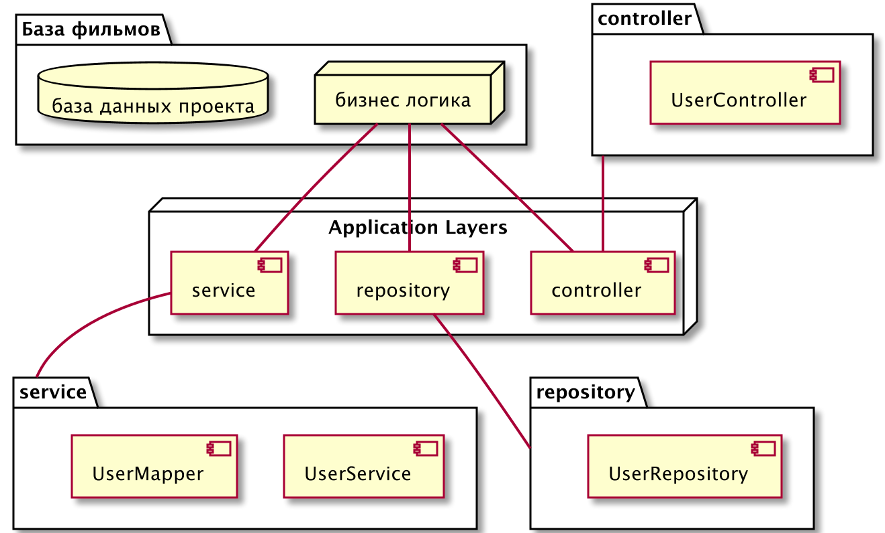
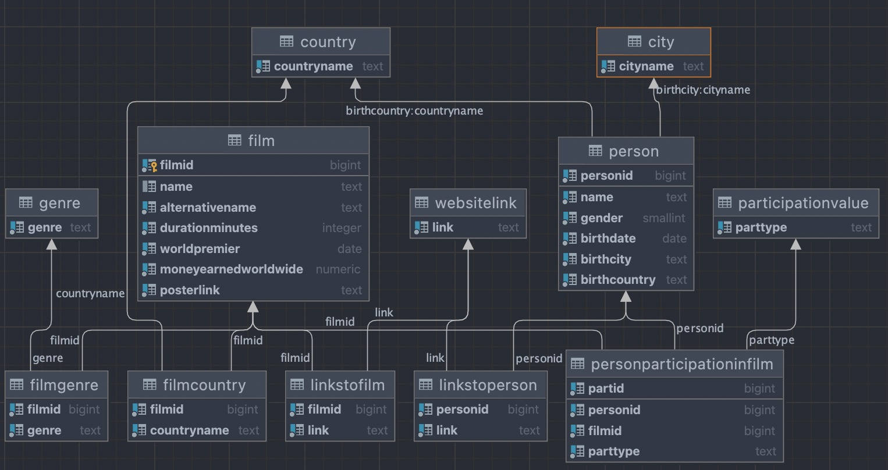

# Агрегатор фильмов

## Техническое задание  

#### В рамках данной работы необходимо:
- создать веб приложение, в котором будет реализовано:
    - Базовый функционал с поиском по все параметрам:
        - список фильмов по *названию*
        - список фильмов *режиссера*
        - список фильмов *сценариста* 
        - список фильмов по *жанрам*
        - список фильмов по *странам*
        - список фильмов по *рейтингу*
        - списки фильмов по *годам выпуска* 
    - Алгоритм автоматического добавления сущностей в базу данных с сайта [КиноПоиск](https://www.kinopoisk.ru) или любого другого агрегатора фильмов, например, [WorldArtA](http://world-art.ru).

    - Создать функцию регистрации пользователя с параметрами:   
        - Никнейм
        - Почта
        - Пароль
    - Разделение пользователей на роли:
        - Незарегестрированный пользователь имеет возможность *просматривать обзоры, рейтинги, имеет доступ ко всем базовым функциям* и не имеет доступа к *выставлению собственный рейтингов, не может писать комментарии*
        - Зарегестрированный пользователь имеет возможность: *писать обзоры*, *комментарии*, *ставить оценки* 
        - Модератор имеет возможность: *писать обзоры, комментарии, ставить оценки, удалять комментарии, удалять обзоры, блокировать пользователей, нарушающих правила сервиса(blacklist)*
        - Администратор (решает вопросы по выдачи пользователю прав модератора и тд). Первый администратор должен иметь собственный интерфес с созданием нового администратора. 
    - Система рейтингов фильмов
        - реализовать *интерфейс*, позволяющий пользователям/модераторам ставить оценки просмотренным фильмам (по 10 бальной шкале)
        - *интерфейс* позволяющий писать обзоры и комментарии к фильмам
        - *интерфейс* выставления рейтингов обзорам

В базе данных приложения должна храниться информация:
- Пользователь:
    - Идентификационный номер(ID)
    - Параметры регистрации(учетная запись)
    - Уровни доступа (зарегестрированный/ незарегистрированный/ модератор)
- Фильм:
    - Название фильма
    - Обложка фильма (*В зависимости от сложности реализации*)
    - Оценка зрителей
    - Список актеров
    - Жанр
    - Год выпуска
    - Страна в которой снимался
    - Краткое описание содержимого фильма
    - Длительность
- Состав съемочной группы (разделенные по типам сущностей):
    - Актеры
    - Режиссер
    - Сценарист
    - Оператор
    - Продюсер
- Список заблокированных пользователей:
    - ID пользователя
    - Причины блокировки
    - Срок блокировки
    - Допольнительные комментарии

##### Архитектура системы:

##### Сущности в базе данных:

